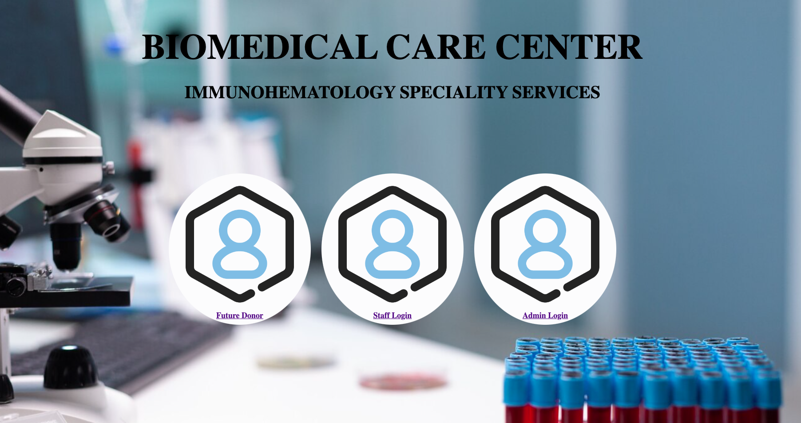
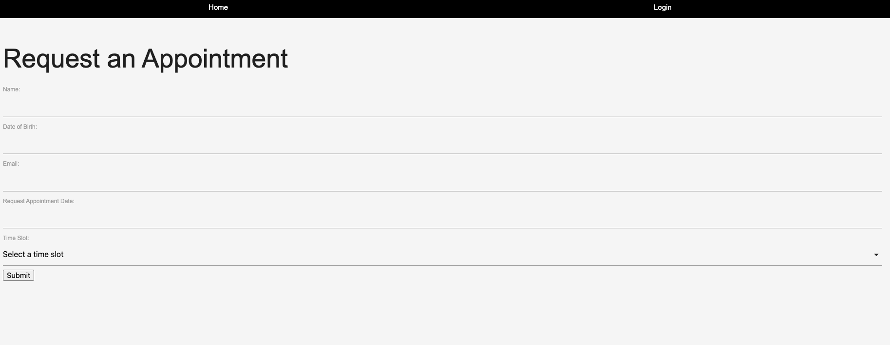
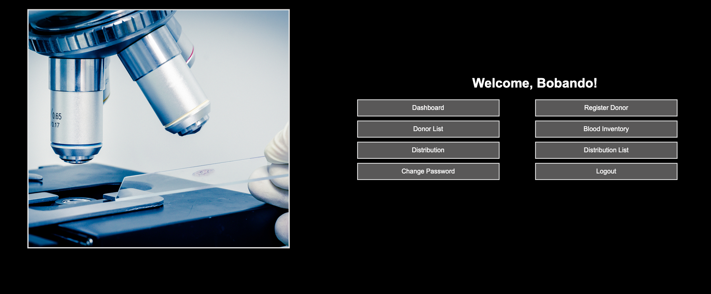
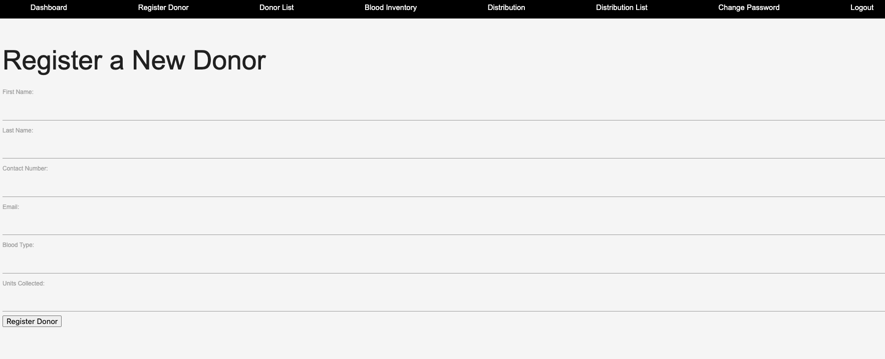
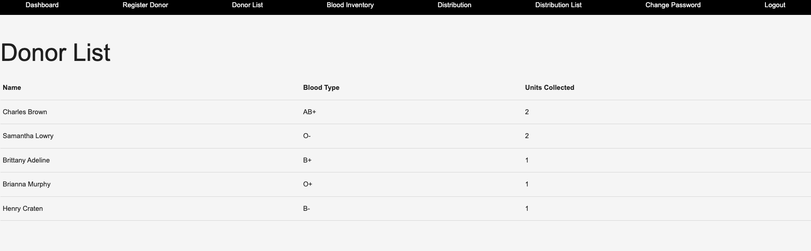
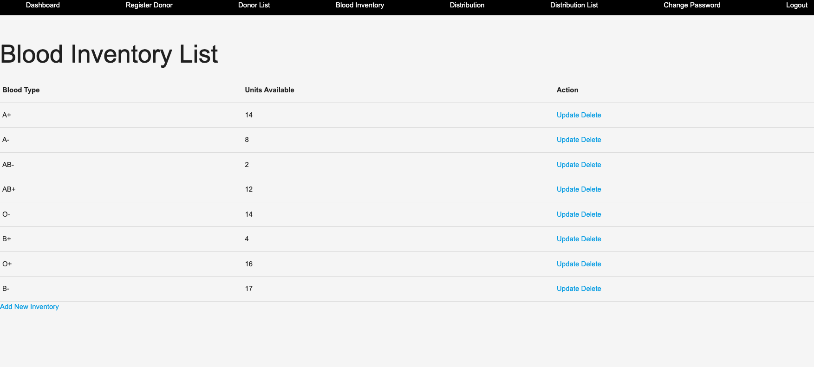
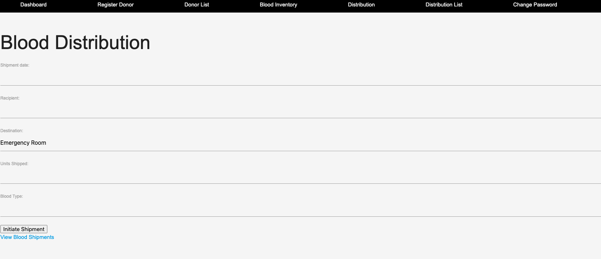

# 🩸 BIOMEDICAL CARE CENTER: Saving Lives, One Drop at a Time! 🩸

## Welcome to the BIOMEDICAL CARE CENTER – an innovative platform dedicated to uniting blood donors and recipients in the noble pursuit of saving lives. 🦸‍♂️🦸‍♀️ Our mission is simple but powerful: make blood donation convenient, efficient, and impactful.

[Launch App Here](https://biomedical-care-center-682cf492b4cf.herokuapp.com/)

## Technologies Used:

- Django
- Python
- Bootstrap
- HTML/CSS

## 🚀 Key Features:

- Donor Registration: Become a Blood Hero in seconds. Our user-friendly registration process ensures you're ready to make a difference.

- Real-Time Blood Inventory: Stay informed with up-to-the-minute updates on available blood units. Every drop counts, and we're making it easy for donors and hospitals to connect seamlessly.

- Life-Saving Appointments: Schedule appointments effortlessly. Donors can pick convenient time slots, ensuring a smooth and organized donation process.

- Emergency Blood Shipments: Our cutting-edge system ensures that when an emergency arises, blood units reach their destination swiftly and efficiently.